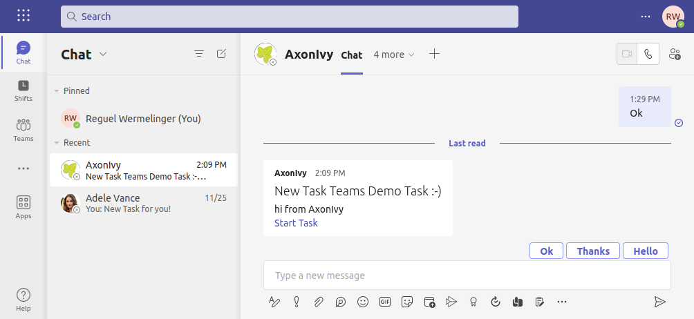

# Microsoft Teams Connector

Axon Ivy’s [Microsoft Chat API](https://learn.microsoft.com/en-us/graph/api/resources/chat?view=graph-rest-1.0)
connector helps you to accelerate process automation initiatives by integrating
Microsoft Teams features into your process application within no time.
Automate message organization and processing. This connector:

- Notifies users in your organization on new AxonIvy workflow Tasks
- Is part of the Microsoft Graph REST API.
- Helps customers stay organized.
- Supports you with an easy-to-copy demo implementation to reduce your
  integration effort.
- Enables low code citizen developers to enhance existing business processes
  with Microsoft Teams features.

## Demo

