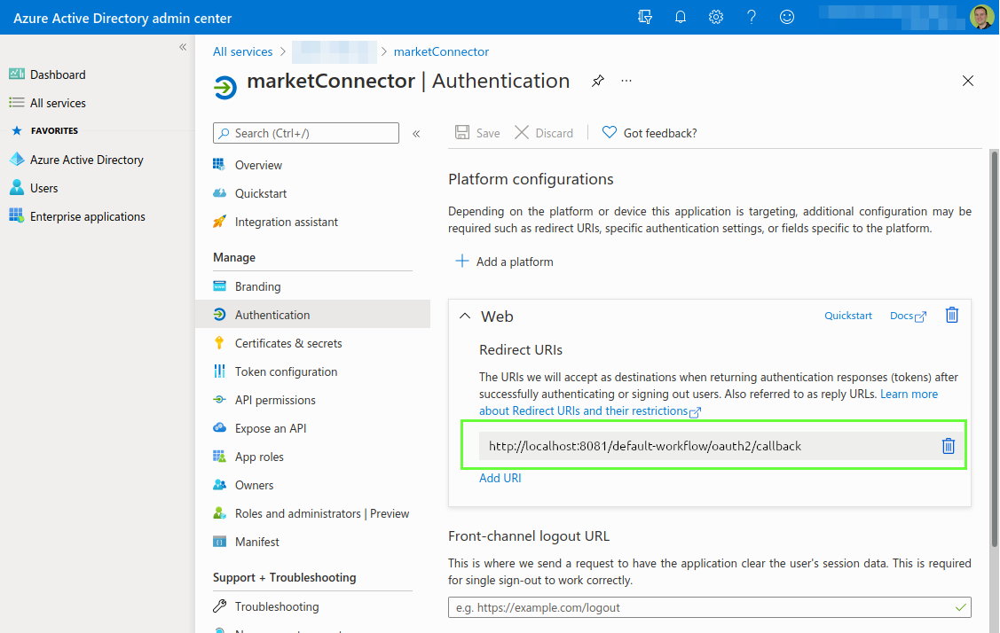
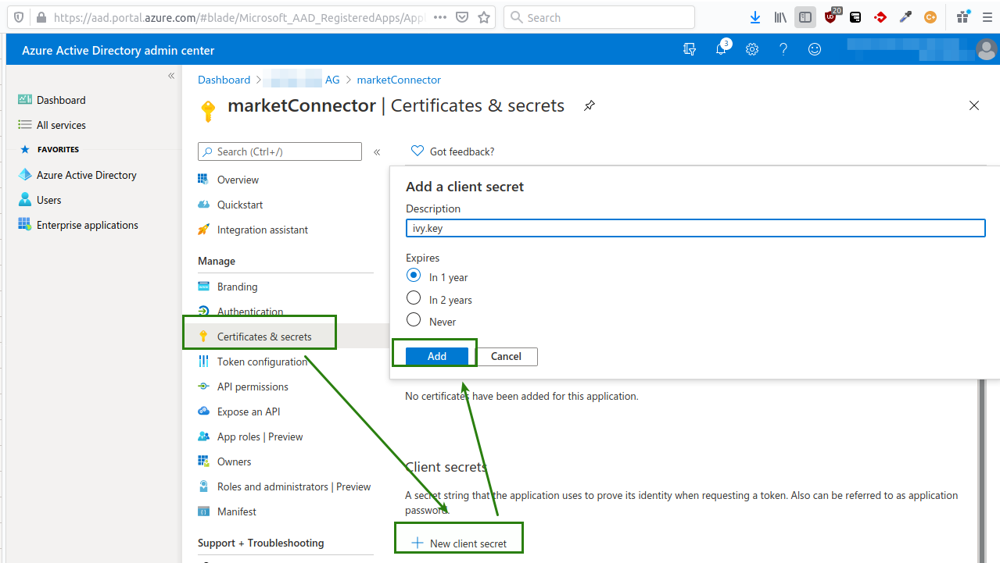
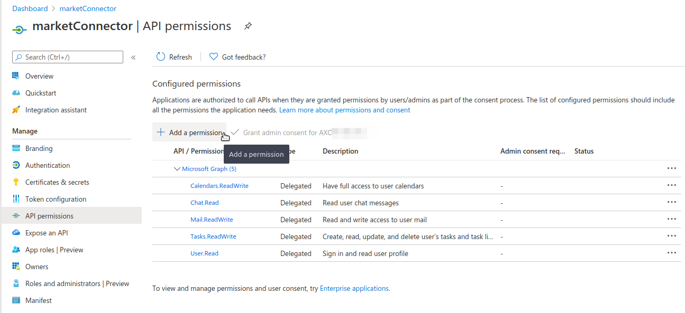

## Setup

### Variables

In order to use this product you must configure multiple variables.

Add the following block to your `config/variables.yaml` file of our 
main Business Project that will make use of this product:

```
@variables.yaml@ 
```

Afterwards set the values as shown in the Azure App setup below.


### Azure App

1. Register an application on Azure as described in the Microsoft's Java Tutorial https://docs.microsoft.com/en-us/graph/tutorials/java?tutorial-step=2
1. Navigate to `Overview` in the menu and copy the 'Application (client) ID' into your variable called `appId` within the `microsoft-connector` section.
1. Navigate to `Authentication` in the Azure App menu.
	1. Add a `Redirect URI` in the `Web` Section.
		- Axon Ivy has an authentication callback URI which follows the pattern `{scheme}://{host}:{port}/{security-sytem}-workflow/oauth2/callback`. This URI must be registered in the Azure App.
		- Consequently, for the Axon Ivy Designer this URI can always be set to the following value: `http://localhost:8081/default-workflow/oauth2/callback`
		- For the Axon Ivy Engine, the URI must contain the full URI where your application is reachable plus the callback path. E.g.: `https://my.workflows.ch/default-workflow/oauth2/callback`
 

1. Navigate to `Certificate & secrets` in the Azure App menu.
  1. Create a new secret by pressing `New client secret`. And select any validity period.
  
  1. copy the value of the generated secret into your variable called `secretKey` within the `microsoft-connector` section.
  

1. Navigate to `API Permissions` in the Azure App menu.
Add permissions via `Add a permission` > `Microsoft Graph` > `Delegated permissions`.
Grant each of the permissions outlined in the `permissions` block of your variables.yaml file.
    

1. Done. Start any process that connects with Microsoft 365.
